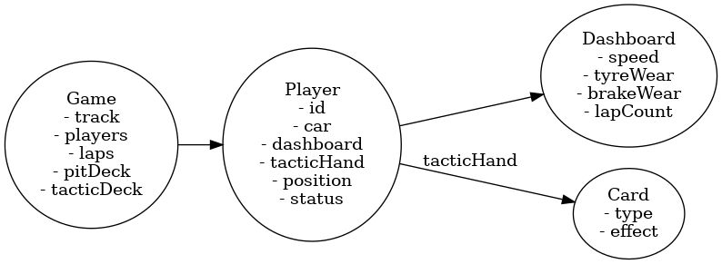
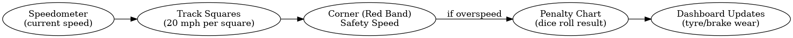

# Waddington’s Formula 1 – Digital Remake Developer Documentation

## Overview

This document provides the structured ruleset, system design, and implementation guidance for recreating *Waddington’s Formula 1* as a digital/web-based game.
The original 1960s board game mechanics are translated here into programmable structures, UI flows, and logical sequences.

---

## 1. Game Overview

- Racing strategy game where movement is deterministic (based on speedometer), not dice.
- Dice are used **only for penalties** when exceeding corner safety speeds.
- Objective: Complete the set number of laps (minimum 3) and cross the finish line first.

---

## 2. Components

- **Race Track Board** (with straights, corners, pits, red safety bands, penalty chart)
- **6 Dashboards** (tracking speed, tyre wear, brake wear, lap count)
- **6 Racing Cars** (Yellow, Orange, Green, Red, Black, Blue)
- **2 Dice** (used only for penalties)
- **Tactic Cards** (special abilities)
- **Pit Cards** (random pit-stop effects)

---

## 3. Setup

1. **Choose Cars**: Players roll dice; highest roll chooses first, then clockwise.
2. **Starting Grid**: Cars are placed on grid in this order:1st = Yellow, 2nd = Orange, 3rd = Green, 4th = Red, 5th = Black, 6th = Blue.
3. **Dashboards**: Each player sets speedometer = 0, tyre wear = 0, brake wear = 0, lap indicator = chosen laps (≥ 3).
4. **Cards**: Shuffle pit deck face-down, shuffle tactic cards and deal 5 to each player.
5. **Dice**: Set aside until needed for penalties.

---

## 4. Movement

- 1 square = 20 mph.
- Speed may increase by 20/40/60 mph per turn, but never more than +60 mph.
- Deceleration allowed but may incur brake/tyre wear (see reduction rules).
- Movement examples:
  - 20 mph = 1 square
  - 40 mph = 2 squares
  - 60 mph = 3 squares
  - 80 mph = 4 squares, etc.
- Only one car per square; cars cannot jump over others.
- Direction: forward only (straight or diagonal).

---

## 5. Corners & Hazards

- Corners marked by **red bands** with safety speeds.
- At/below safety speed: no penalty.
- Overspeeding:
  - +10 or +20 mph: roll dice, apply penalty chart.
  - +40 mph: roll dice with higher penalty chance.
  - +60 mph+: automatic spin-off.
- If crossing multiple red bands in one move, roll separately for each.

---

## 6. Penalties & Spin-Offs

### Spin-off conditions

- Exceed safety speed by ≥ 60 mph.
- Forced deceleration > 20 mph when brakes are maxed out.
- Crossing a corner while tyre wear = 8.
- Certain penalty dice outcomes.

### Spin-off resolution

- Car placed on nearest spin-off point (or outside of track if due to baulking).
- Speedometer reset to 0.
- Tyre/brake wear unchanged.
- Next turn, car restarts at 60 mph.

---

## 7. Speed Reduction & Wear

- −20 mph: no wear.
- −40 mph: brake wear only.
- −60 mph or more: brake + tyre wear.
- Tyre wear max = 8. At max, cars may only reduce by −40 mph.

---

## 8. Lap Indicator

- Records laps completed.
- Set to chosen number at race start.
- Decreases by 1 when crossing finish line.
- Race ends when indicator reaches 0.

---

## 9. Baulking (Blocking)

- Cars can block others at corners or narrow sections.
- Baulked car must move up to square directly behind blocker.
- Speed reduced to blocker’s speed (apply wear penalties).
- If blocker is faster, baulked car may accelerate up to blocker’s speed (≤ +60 mph), but no extra movement.
- If baulked in pits/spin-off, speedometer can reset to 60 mph for restart.

---

## 10. Pits

- Must stop exactly on own pit square; overshooting means continuing.
- Effects: reset brakes, tyres, and speedometer to 0 (lap unchanged).
- Draw 1 pit card and apply effect before exiting.
- Exit pits next turn at 60 mph.

---

## 11. Tactic Cards

- Each player starts with 5 cards.
- Played for extra moves or cornering advantages.
- Normally used **after movement but before dice roll**.
- Exception: *Superb Driving* is played before movement.
- Only 1 tactic card per turn.
- Discard after use.

---

## 12. Finishing & Winning

- Car finishes by crossing finish line after required laps.
- All players complete the same number of turns.
- Winner = furthest past finish line after final turn.

---

## 13. Championship Mode (Optional)

Points awarded per race:

- 1st = 10 points
- 2nd = 8 points
- 3rd = 6 points
- 4th = 4 points
- 5th = 2 points
- 6th = 1 point
  Champion = driver with most cumulative points after multiple races.

---

## 14. Key Mechanics Summary

- Deterministic movement.
- Dice used for penalties only.
- Risk/reward trade-offs in cornering.
- Resource management: tyres, brakes.
- Tactical blocking and pit strategy.
- Tactic cards add unpredictability.

---

## System Design

### Data Structures

### UI Layout

### Logic Flow (Per Turn)

### Movement & Penalty Tracking

---

## Implementation Notes

- **Game State**: Central object holding track, players, laps, pit deck, tactic deck.
- **Player State**: Car + dashboard (speed, wear, laps) + tactic cards.
- **Turn Sequence**: Adjust speed → move → check hazards → roll penalties → apply wear → tactic card → next player.
- **UI**: Dashboards interactive; dice rolls & penalties clearly displayed.
- **Persistence**: Championship mode should persist scores.

---

## Development Roadmap

- Phase 1: Core speed/movement mechanics.
- Phase 2: Corners, hazards, penalties, wear tracking.
- Phase 3: Tactic and pit cards.
- Phase 4: Baulking & multiplayer.
- Phase 5: Championship/league system.

---
